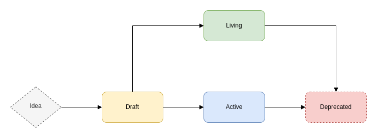

## Abstract

At its core, a Voi Improvement Proposal (VIP) describes standards for the Voi ecosystem, including core protocol specifications, client APIs, and contract standards. This document outlines the guidelines for creating a VIP.

## Motivation

VIPs are intended to serve as a reference point within the Voi community and to encourage a cohesive consensus on standards.

## Specification

The keywords "MUST", "MUST NOT", "REQUIRED", "SHALL", "SHALL NOT", "SHOULD", "SHOULD NOT", "RECOMMENDED", "NOT RECOMMENDED", "MAY", and "OPTIONAL" in this document are to be interpreted as described in [RFC 2119](https://www.ietf.org/rfc/rfc2119.txt) and [RFC 8174](https://www.ietf.org/rfc/rfc8174.txt).

A VIP is a design document providing information to the Voi community, or it describes a new feature for Voi or its processes or environment. A VIP should provide a concise technical specification of the feature and a rationale for that feature.

Fundamentally, VIPs are intended as the primary mechanism for driving standards in the Voi ecosystem.

### VIP Category

VIP categories are intended to easily recognize the nature of a VIP. A VIP is categorized by placing the VIP in the corresponding category directory. For instance, this VIP falls under the 00-Meta category, so it is located in `vips/00/`.

> 💡 **TIP:** A VIP **MUST** be referenced using the notation `VIP-<category>-<index>`, ensuring an individual can gauge the intention of the VIP. For example, a VIP within the Application category would be referenced as: `VIP-03-0200`.

Each VIP **MUST** be categorized in one of the following types:

#### 00-Meta

Provides guidelines, procedures, changes to processes or information to the Voi community. Meta VIPs are (often) not technical. For instance, this VIP, which serves as a guideline to all VIPs, is categorized as Meta.

#### 01-Core

Proposed improvements to the core network protocol, e.g. increasing transaction fees.

#### 02-Interface

Improvements around client API/RPC specifications and also certain language-level standards like method names and contract ABIs. For example, a VIP that provides a JSON message schema for the communication between a dApp and a wallet.

#### 03-Application

Application-level standards and conventions, including contract standards such as token standards, name registries, URI schemes, library/package formats, and account abstraction.

### VIP Index

Each VIP **MUST** have a non-conflicting index, between 0000-9999, associated with it. This index can be assigned at the discretion of the author, but it **SHALL NOT** conflict with an existing VIP within the same category.

When creating a VIP, you must create a subdirectory within the category directory and name this directory as the VIP index with padded zeroes. The document containing the VIP **MUST** be named: `index.md`.

For instance, a VIP with an index `0200`, and is part of the Application category, will be: `/vips/03/0200/index.md`.

```text
.
├── vips
│   ├── 03                <-- category index
│   │   ├── 0200          <-- vip index
│   │   │   └── index.md  <-- vip document
│   │   └── ...
│   └── ...
└── ...
```

### Process

#### VIP Conception

Before writing a VIP, it is highly **RECOMMENDED** that a VIP be the outcome or consequence of an existing process. In other words, a VIP can be a technical write-up of a technology that is being developed or for one that is already in use.

> _Build first, write a specification later._

Following this ethos allows a specification to have a real world use-case and can highlight some issues and considerations that can be addressed before the VIP is formulated or as an important discussion point during the review of the VIP.

#### VIP Status

The journey of a VIP from conception to standardization is governed by a set of statuses. An explanation of the statuses are as follows:

* `Draft`: The first formally tracked stage of a VIP in development. When opening a PR, and when the VIP is ready to be reviewed, ensure that the status is set to `Draft`. VIPs that are being reviewed are still considered to be in the `Draft` state.
* `Active`: This represents the final standard. A VIP with the status `Active` exists in a state of finality and should only be updated to correct errata and add non-normative clarifications. If a VIP is in an `Active` state, and it needs a critical update, a new VIP **MUST** be created to supersede the previous VIP.
* `Deprecated`: These are VIPs that are no longer relevant and are considered obsolete. They will exist only for prosperity but are considered non-canon.

Some VIPs can have a special status:

* `Living`: This status is special in that the VIP remains in a state of perpetuity and is designed to be continually updated and not reach a state of finality. Most notably, this VIP, `VIP-00-0000`, is a `Living` standard.

The VIP status flow can be explained as:



As you can see, the VIP's first status will be `Draft`. This is where a VIP will be composed and discussed.

Once a consensus has been reached, the VIP will be moved into an `Active` state. This means the VIP is in a state of finality and should only be updated for trivial issues such as correcting errata. A VIP's fundamentals cannot be changed in this state, and must be either superseded by another VIP or `Deprecated`.

A VIP can move into a special state called `Living`, which is same as `Active`, but allows for updates.

### VIP Format

All VIPs **MUST** be written in the GitHub [markdown](https://github.com/adam-p/markdown-here/wiki/Markdown-Cheatsheet) format. Here is a [template](../../../vip-template.md) to follow.

There are essentially two parts to a writing a VIP:

* [VIP Header Preamble](#vip-header-preamble): This is the metadata of the VIP. It contains properties such as the title, description, index and authors.
* [VIP Content](#vip-content): This is the actual meat of the VIP. It is broken down into further categories that are explained below.

#### VIP Header Preamble

Each VIP must begin with an [RFC 822](https://www.ietf.org/rfc/rfc822.txt) style header preamble, preceded and followed by three hyphens (---). This header is also termed “[front matter](https://gohugo.io/content-management/front-matter/)” by the Hugo static site generator.

The headers **MUST** appear in the following order:

##### `index` Header

This is **REQUIRED**.

This is a number that is used to index/reference the VIP within a category. See [index](#vip-index) for more information.

When using the `index` in the header, it must be written in the hydrated form and **MUST** not pad zeroes. E.g. 10, not 0010.

##### `title` Header

This is **REQUIRED**.

This is the VIP in a few words, but not a complete sentence.

* **SHOULD NOT** include the word "standard" or any variation thereof; and
* **SHOULD NOT** include the VIP’s index.

##### `description` Header

This is **REQUIRED**.

This is one full (short) sentence that describes the VIP.

* **SHOULD NOT** include the word "standard" or any variation thereof; and
* **SHOULD NOT** include the VIP’s index.

##### `author` Header

This is **REQUIRED**.

The `author` lists the names, email addresses or the GitHub usernames of the authors/owners of the VIP. Those who prefer anonymity may use a username only, or a first name and a username.

The format of the author header value must be:

> Random J. User <address@dom.ain>

or

> Random J. User (@username)

if the email address and/or GitHub username is included, and

>Random J. User

if neither the email address nor the GitHub username are given.

At least one author **MUST** use a GitHub username, in order to get notified on change requests and have the capability to approve or reject them.

##### `status` Header

This is **REQUIRED**.

**MUST** be one of:

* `Draft`
* `Active`
* `Deprecated`
* `Living`

See [here](#vip-status) for more information on how each status is determined and what they mean.

##### `created` Header

This is **REQUIRED**.

The date the VIP was created on. **MUST** be in [ISO 8601](https://www.cl.cam.ac.uk/~mgk25/iso-time.html) (yyyy-mm-dd) format.

##### `discussion_to` Header

This is **OPTIONAL**, but **RECOMMENDED**.

The URL pointing to the official discussion thread.

##### `requires` Header

This is **OPTIONAL**.

The full VIP indexes (VIP-03-0200) that are required by the VIP.

A `requires` dependency is created when the current VIP cannot be understood or implemented without a concept or technical element from another VIP. Merely mentioning another VIP does not necessarily create such a dependency.

#### VIP Content

The content of a VIP, follows a structure that contains several parts:

* **Abstract** (**REQUIRED**) - The Abstract is a multi-sentence (short paragraph) technical summary. This should be a very terse and human-readable version of the specification section. Someone should be able to read only the abstract to get the gist of what this specification does.
* **Motivation** (**OPTIONAL**) - A motivation section is critical for VIPs that want to change the Voi protocol. It should clearly explain why the existing protocol specification is inadequate to address the problem that the VIP solves. This section may be omitted if the motivation is evident.
* **Specification** (**REQUIRED**) - The technical specification should describe the syntax and semantics of any new feature. The specification should be detailed enough to allow competing, interoperable implementations for any of the current Voi tools/clients.
* **Rationale** (**REQUIRED**) - The rationale fleshes out the specification by describing what motivated the design and why particular design decisions were made. It should describe alternate designs that were considered and related work, e.g. how the feature is supported in other languages. The rationale should discuss important objections or concerns raised during discussion around the VIP.
* **Backwards Compatibility** (**OPTIONAL**) - All VIPs that introduce backwards incompatibilities must include a section describing these incompatibilities and their consequences. The VIP must explain how the author proposes to deal with these incompatibilities. This section may be omitted if the proposal does not introduce any backwards incompatibilities, but this section must be included if backward incompatibilities exist.
* **Test Cases** (**OPTIONAL**) - Test cases for an implementation are mandatory for VIPs that are affecting consensus changes. Tests should either be inlined in the VIP as data (such as input/expected output pairs, or included in the VIP's directory. This section may be omitted for non-Core proposals.
* **Reference Implementation** (**OPTIONAL**) - An optional section that contains a reference/example implementation that people can use to assist in understanding or implementing this specification. This section may be omitted for all VIPs.
* **Security Considerations** (**REQUIRED**) - All VIPs must contain a section that discusses the security implications/considerations relevant to the proposed change. Include information that might be important for security discussions, surfaces risks and can be used throughout the life-cycle of the proposal. E.g. include security-relevant design decisions, concerns, important discussions, implementation-specific guidance and pitfalls, an outline of threats and risks and how they are being addressed. VIP submissions missing the “Security Considerations” section will be rejected. An VIP cannot proceed to status “Final” without a Security Considerations discussion deemed sufficient by the reviewers.
* **Copyright Waiver** (**REQUIRED**) - All VIPs must be in the public domain. The copyright waiver **MUST** link to the license file and use the following wording: Copyright and related rights waived via [CC0](../../../LICENSE).

### Auxiliary Files

Images, diagrams and auxiliary files should sit alongside the VIP in the directory as follows: `vips/<category>/<index>` (where category is the `category` index and `index` is the VIP index).

```text
.
├── vips
│   ├── 03                <-- category index
│   │   ├── 0200          <-- vip index
│   │   │   ├── index.md
│   │   │   ├── image.jpg <-- auxiliary files sit alongside vip document
│   │   │   └── ...
│   │   └── ...
│   └── ...
└── ...
```

When linking to an image in the VIP, use relative links, such as `./image.png`.

## Rationale

This VIP serves as a foundation to outline the guidelines and format of, not only the structure of a VIP, but also the VIP process.

Although this VIP sets out many ground rules, the flexibility afforded to the VIP process allows these formats/processes to be superseded by new VIPs.

## Security Considerations

None.

## Copyright

Copyright and related rights waived via [CC0](../../LICENSE).
