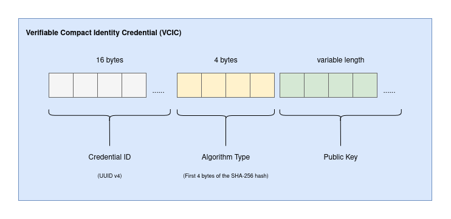

## Abstract

The Verifiable Compact Identity Credential (VCIC) is a lightweight standard for identity-based credentials that enables providers to securely prove their identity using a challenge-response mechanism. This specification defines the structure, signing algorithms, and verification process for VCICs, ensuring interoperability across implementations.

## Motivation

Identity verification is a critical component of secure communication between providers and clients. Existing standards, such as [JWTs][rfc7519], often lack compactness and determinism, rendering them unsuitable for environments that require credentials to meet this requirement.

The VCIC addresses these challenges by introducing a lightweight and efficient standard while maintaining robust security through a challenge-response mechanism.

## Specification

The keywords "MUST", "MUST NOT", "REQUIRED", "SHALL", "SHALL NOT", "SHOULD", "SHOULD NOT", "RECOMMENDED", "NOT RECOMMENDED", "MAY", and "OPTIONAL" in this document are to be interpreted as described in [RFC 2119](https://www.ietf.org/rfc/rfc2119.txt) and [RFC 8174](https://www.ietf.org/rfc/rfc8174.txt).

### Definitions

This section is non-normative.

* **Client**
  - An end-user application that interacts with a provider; e.g. a dApp.
* **Provider**
  - An application that manages private keys and performs signing operations; e.g. a wallet.

### Structure

The main intended purpose of the VCIC is to facilitate communication by identifying and verifying a provider to a client.

The structure follows a linear array of bytes which allows for the credential to be deterministic and can be easily sent, ensuring that the client can:
* identify the provider from the message response; and
* verify the message integrity.

Although deterministic, a VCIC should be globally unique and capable of uniquely identifying a provider.

The below diagram outlines the structure of a VCIC.



where:
* `Credential ID`:
  - **MUST** be a decoded [UUIDv4][rfc4122] compliant string (hyphens removed).
  - **MUST** be 16 bytes.
* `Algorithm Type`:
  - **MUST** be the first 4 bytes of the SHA-256 hash of one of the types specified in the [Algorithm Types](#algorithm-types) section.
* `Public Key`:
  - **MUST** be a public key of the keypair that used the specified Algorithm Type in its creation.
  - **MAY** be of variable length (e.g. if the algorithm `Ed25519` was used to create the keypair, the `Public Key` will be 32 bytes).

### Algorithm Types

The choice of signing algorithm is at the provider's discretion, but the provider **MUST** use one of the following algorithm types in order for a client to know the type and/or variant of the algorithm that was used to sign a message challenge.

| ID        | Description                                                                                                                                   | Public Key Size |
|-----------|-----------------------------------------------------------------------------------------------------------------------------------------------|-----------------|
| `Ed25519` | Ed25519 belongs to the EdDSA family of algorithms and uses a SHA-512 hash. It is fast and secure and is used in the creation of AVM accounts. | 32 bytes        |
| `ES256K`  | The ECDSA algorithm using the secp256k1 curve and SHA-256 hashing, is strong & efficient and is used in the creation of EVM accounts.         | 64 bytes        |

> 💡 **TIP:** It is **RECOMMENDED** that the `Ed25519` algorithm is used due to its close affiliation with AVM accounts and its more compact size - the public key is 32 bytes compared to 64 bytes for `ES256K`.

## Reference Implementation

### Node.js (TypeScript)

Here is an example of a credential being created:

```typescript
import { createHash } from 'crypto';

const createCredential = (id: string, algorithm: string, publicKey: Buffer) => {
  const decodedCredentialID = Buffer.from(value.replace(/-/g, ''), 'hex'); // credential id - hyphens removed
  const algorithmHash = createHash('sha256')
    .update(algorithm)
    .digest()
    .slice(0, 4); // first 4 bytes of the hash

  return Buffer.concat([
    decodedCredentialID,
    algorithmHash,
    publicKey,
  ], (decodedCredentialID.length + algorithmHash.length + publicKey.length));
};
```

Here is an example of a credential being parsed:

```typescript
import { createHash } from 'crypto';

const isAlgorithmType = (hash: Buffer, type: string) => {
  // create a sha-256 hash of the algorithm type and compare the first 4 bytes
  return createHash('sha256')
    .update(type)
    .digest()
    .slice(0, 4)
    .equals(hash);
}

const parseCredential = (credential: Buffer) => {
  const credentialID = credential.slice(0, 16); // first 16 bytes
  const algorithmHash = credential.slice(credentialID.length, (credentialID.length + 4)); // next 4 bytes
  const publicKey = credential.slice(credentialID.length + algorithmHash.length); // remaining bytes
  let algorithm: string | null = null;

  if (isAlgorithmType(algorithmHash, 'Ed25519')) {
    algorithm = 'Ed25519';
  }

  if (isAlgorithmType(algorithmHash, 'ES256K')) {
    algorithm = 'ES256K';
  }

  if (!algorithm) {
    throw new Error('UnsupportedAlgorithmTypeError');
  }

  return {
    algorithm,
    id: credentialID.toString('hex'),
    publicKey: publicKey.toString('base64'),
  };
};
```

### Flutter (Dart)

Here is an example of a credential being created:

```dart
import 'dart:convert';
import 'dart:typed_data';
import 'package:crypto/crypto.dart';

Uint8List createCredential(String id, String algorithm, Uint8List publicKey) {
  // decode the credential id (remove hyphens and convert from hex)
  final decodedCredentialID = Uint8List.fromList(
    id.replaceAll('-', '').codeUnits.map((char) => int.parse(String.fromCharCode(char), radix: 16)).toList(),
  );

  // create a sha-256 hash of the algorithm and take the first 4 bytes
  final algorithmHash = sha256.convert(utf8.encode(algorithm)).bytes.sublist(0, 4);

  final totalLength = decodedCredentialID.length + algorithmHash.length + publicKey.length;
  final result = Uint8List(totalLength);

  // copy data into result buffer
  result.setRange(0, decodedCredentialID.length, decodedCredentialID);
  result.setRange(decodedCredentialID.length, decodedCredentialID.length + algorithmHash.length, algorithmHash);
  result.setRange(decodedCredentialID.length + algorithmHash.length, totalLength, publicKey);

  return result;
}
```

Here is an example of a credential being parsed:

```dart
import 'dart:convert';
import 'dart:typed_data';
import 'package:crypto/crypto.dart';

bool isAlgorithmType(Uint8List hash, String type) {
  // create a sha-256 hash of the algorithm type and compare the first 4 bytes
  final algorithmHash = sha256.convert(utf8.encode(type)).bytes.sublist(0, 4);

  return Uint8List.fromList(algorithmHash).toString() == hash.toString();
}

Map<String, dynamic> parseCredential(Uint8List credential) {
  // extract parts of the credential
  final credentialID = credential.sublist(0, 16); // first 16 bytes
  final algorithmHash = credential.sublist(credentialID.length, (credentialID.length + 4)); // next 4 bytes
  final publicKey = credential.sublist(credentialID.length + algorithmHash.length); // remaining bytes
  String? algorithm;

  // get the algorithm type from the supported types
  if (isAlgorithmType(algorithmHash, 'Ed25519')) {
    algorithm = 'Ed25519';
  } else if (isAlgorithmType(algorithmHash, 'ES256K')) {
    algorithm = 'ES256K';
  } else {
    throw Exception('UnsupportedAlgorithmTypeError');
  }

  return {
    'algorithm': algorithm,
    'id': credentialID.map((byte) => byte.toRadixString(16).padLeft(2, '0')).join(), // convert to hex
    'publicKey': base64Encode(publicKey),
  };
}
```

## Rationale

The design of VCIC prioritizes compactness and efficiency while maintaining robust security through cryptographic signing and verification processes. Alternative designs were considered but lacked the compactness or flexibility required for modern applications, particularly in communication where a credential must be compact and deterministic.

## Security Considerations

* When creating the keypair, a provider **MUST** ensure that no private key material is appended to the credential. This could compromise the credential and open up the credential's intended purpose to attack vectors.
* The combination of a UUIDv4 identifier and the public key **SHOULD** ensure that a VCIC is globally unique. While there is a probabilistic chance of collision, this likelihood is small enough that it can be considered acceptable.

## Copyright

Copyright and related rights waived via [CC0](https://creativecommons.org/publicdomain/zero/1.0/legalcode.txt).

<!-- links -->
[rfc4122]: https://datatracker.ietf.org/doc/html/rfc4122
[rfc7519]: https://datatracker.ietf.org/doc/html/rfc7519
